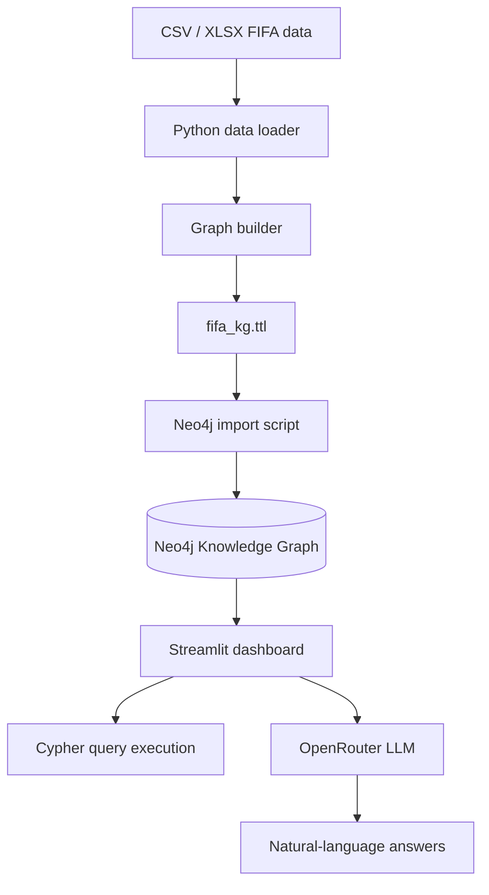

# FIFA Knowledge Graph Project Workflow

## Component overview

| Component | Role | Technology | Connection |
| --- | --- | --- | --- |
| Data sources | Historical FIFA results and 2022 player metadata | CSV / XLSX files | Loaded by Python preprocessing scripts |
| Data loader | Normalizes and prepares tabular data | pandas | Feeds into graph construction |
| Graph builder | Creates RDF triples from entities and relationships | rdflib | Produces the knowledge graph file |
| Neo4j database | Stores and queries the graph | Neo4j | Receives imported relationships and nodes |
| Streamlit app | Provides user interface for querying and AI chat | Streamlit + Python | Connects to Neo4j and optionally OpenRouter |
| OpenRouter | Optional LLM layer for natural-language queries | OpenRouter API | Receives graph context and generates answers |

## Workflow summary

1. Raw FIFA data is loaded from datasets in the project folder.
2. The preprocessing layer cleans column names and standardizes values.
3. The graph builder creates RDF triples for tournaments, teams, players, clubs, and nationality links.
4. The generated graph is serialized to a Turtle file.
5. The Neo4j import script pushes nodes and relationships into the Neo4j graph database.
6. The Streamlit dashboard runs Cypher queries against Neo4j and optionally augments answers with OpenRouter.

## Mermaid diagram

## Connection notes

- The project relies on a local Neo4j instance running at `bolt://localhost:7687`.
- The default credentials are stored in `.env` and not committed to source control.
- The app uses `OPENROUTER_API_KEY` only when a user wants AI-assisted natural-language replies.
- The graph can be queried with Cypher directly from the dashboard or through the AI layer using graph context.
