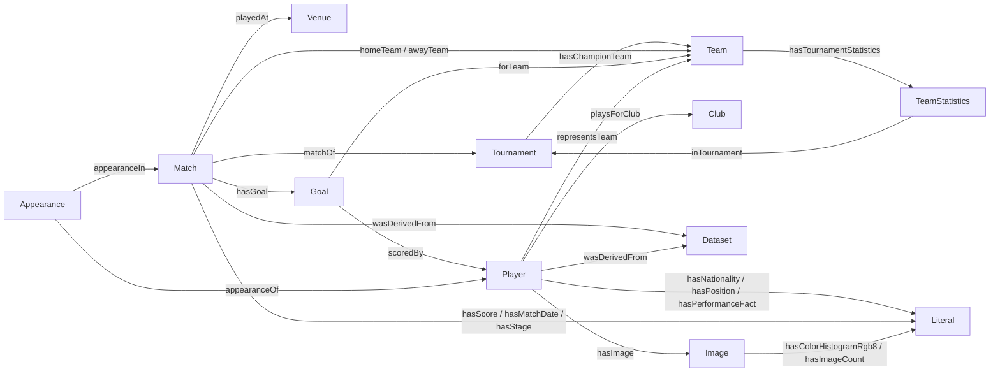

# Multimedia Information Retrieval for Sports Analytics

## FIFA World Cup 2022 Knowledge Graph

**Information Retrieval Exam Project — Academic Year 2025/2026** | **Course:** Information Retrieval

## Abstract and objectives

This project builds a source-grounded knowledge graph (KG) for retrieval over FIFA World
Cup data. It preprocesses and audits the required tabular and image sources, represents
tournament, team, player, match, goal, appearance, venue and image facts as RDF triples,
imports the graph into Neo4j, and evaluates Cypher queries against answers derived from
the input data. A Streamlit dashboard supports graph exploration and direct Cypher
retrieval. Its optional language-model feature is not treated as evidence.

The main information-retrieval objective is to connect facts split across datasets. A
query can start from a match and reach its tournament, venue, teams, goals and scorers;
similarly, a player can be connected to statistics, national team, club, appearances and
image features.

## 1. Data and preprocessing

### 1.1 Sources and categories

| Data source | Data categories | Role in the KG |
|---|---|---|
| Professor-provided FIFA World Cup summary CSV | Tournament years, hosts, champions, runners-up, match/goal totals | 22 historical tournament resources |
| Professor-provided FIFA 2022 team standings CSV | Teams, games, wins, draws, losses, goals and points | 32 team tournament-statistics resources |
| Professor-provided FIFA 2022 player-statistics CSV | Players, nationality, position, club, performance statistics and sponsors | 814 player records |
| Professor-provided all-player names CSV | FIFA 2022 player roster | 830 player names |
| Professor-provided FIFA 2022 image collection | JPEG assets grouped by player | 831 player folders and 41,510 JPG files |
| [jfjelstul/worldcup](https://github.com/jfjelstul/worldcup) CSV data | Matches, goal events and player appearances | WC-2022 filtered event and match facts |

The three match-level CSV files are downloaded by
[`scripts/fetch_worldcup_data.py`](./scripts/fetch_worldcup_data.py) from a pinned
upstream commit (`35a8667f518b07469182ae16d35574dd0e7a00fb`). This makes the
professor-required historical source reproducible while keeping downloaded data separate
from source code. The graph includes 64 2022 matches, 172 goals and 1,995 appearance
records from that source. Records are selected by the stable `WC-2022` tournament ID.

### 1.2 Cleaning and quality checks

[`src/fifa_kg/data_loader.py`](./src/fifa_kg/data_loader.py) trims column names and
string values, normalizes empty and dash placeholders to missing values, and retains
source row counts. The pipeline parses numeric and percentage fields into typed RDF
literals, preserves source identifiers, and does not drop whole rows because optional
values are missing. Tournament-specific event files are filtered using
`tournament_id = WC-2022`.

Each graph build writes `output/data_quality.json` with source row counts, column names,
duplicate-row counts and missing-value counts by column. Input files remain unchanged.
The 2022 player-statistics CSV has some missing optional values; these are omitted as
facts instead of being stored as strings such as `-`.

## 2. Ontology and global schema

The ontology uses stable URI resources for domain entities and RDF literals for their
values. `rdf:type` assertions identify classes; named predicates encode links; and
`wasDerivedFrom` records source provenance.



The main classes are `Tournament`, `Team`, `TeamTournamentStatistics`, `Player`,
`Match`, `Goal`, `Appearance`, `Venue`, `Club`, `Image` and `Dataset`. Core predicates
include `matchOf`, `homeTeam`, `awayTeam`, `playedAt`, `hasGoal`, `scoredBy`,
`appearanceOf`, `appearanceIn`, `playsForClub`, `representsTeam`, `hasImage`,
`hasTournamentStatistics` and `wasDerivedFrom`.

## 3. KG construction and storage

[`src/fifa_kg/graph_builder.py`](./src/fifa_kg/graph_builder.py) converts the cleaned
tables into RDF triples with `rdflib`; [`src/run_pipeline.py`](./src/run_pipeline.py)
serializes them to the portable Turtle file `fifa_kg.ttl`. The builder links World Cup
summary facts to tournament and team resources; models the separate 2022 standings as
team-statistics resources; and represents source match, goal and player-appearance rows
as identifiable resources with typed facts and provenance.

[`src/neo4j_import.py`](./src/neo4j_import.py) imports resources and literals into
Neo4j. RDF predicate local names are used for relationship types, RDF literal datatypes
and languages are preserved on relationships, and imports are batched. Normal imports
are additive. `--replace` explicitly deletes all nodes and relationships in the selected
Neo4j database before import; the one-command reset workflow calls that option
deliberately.

## 4. Multimedia feature extraction

The image collection contains tens of thousands of JPG files. To keep feature extraction
repeatable and graph size practical, the pipeline selects the lexicographically first
JPEG in each `Images_<player>` folder as a representative asset. It records the
relative path, original dimensions and total JPG count in that player folder.

Pillow resizes each representative image to 64×64 RGB pixels and calculates a
normalized 24-value histogram (eight bins for each RGB channel). The histogram is
stored as an RDF literal linked to the `Image` resource. This is an interpretable
low-level visual descriptor, not a learned semantic representation or face-recognition
system. Queries can retrieve descriptors and image availability alongside player facts.

## 5. Semantic retrieval

[`cyphers.md`](./cyphers.md) contains the read-only query catalog. It includes historical
tournament outcomes, 2022 standings, match/venue details, goal scorers, player
appearances, player statistics, image features and source provenance. Example:

```cypher
MATCH (m:Resource)-[:matchOf]->(t:Resource),
      (m)-[:playedAt]->(venue:Resource),
      (m)-[:hasScore]->(score:Literal)
WHERE t.uri ENDS WITH '/Tournament/2022'
RETURN m.uri AS match, venue.uri AS venue, score.value AS score
ORDER BY match;
```

Neo4j/Cypher is the authoritative retrieval layer. Streamlit offers saved examples,
direct Cypher retrieval, a graph visualization, and an optional OpenRouter-backed chat.
Dashboard Cypher requests run inside read transactions; the chat feature is not required
for the KG to function.

## 6. Performance evaluation

[`scripts/evaluate.py`](./scripts/evaluate.py) runs a warm-up followed by repeated
read-only Cypher executions, compares the result with ground truth derived from the
corresponding local files, records the median wall-clock latency, and writes
`output/evaluation.json`. The benchmark suite covers:

1. the historical summary's 2022 champion;
2. Argentina's FIFA 2022 points;
3. Lionel Messi's nationality, position and club;
4. the number of WC-2022 matches;
5. Messi's 2022 goal events;
6. Messi's 2022 match appearances;
7. player-image feature and source-file coverage.

The measured local results are:

| Benchmark | Expected = returned | Correct | Median latency (ms) |
|---|---:|:---:|---:|
| Historical 2022 champion | Argentina | Yes | 1.019 |
| Argentina tournament points | 18 | Yes | 1.496 |
| Lionel Messi profile and club | Argentina / FW / PSG | Yes | 1.257 |
| FIFA 2022 match coverage | 64 | Yes | 0.872 |
| Lionel Messi goal events | 7 | Yes | 1.098 |
| Lionel Messi match appearances | 7 | Yes | 1.317 |
| Player image feature coverage | 831 images / 41,510 files | Yes | 5.146 |

All seven benchmarks passed against source-derived ground truth. The generated
[`report.pdf`](./report.pdf) includes the executed queries, expected and returned
results, correctness and median latency. Correctness is checked against the relevant
source file, not against LLM output. Timings describe one local Neo4j instance and vary
with hardware, cache and concurrent workload; they should not be interpreted as a
cross-database performance claim.

## 7. Critical analysis, limitations and future work

The KG supports multi-hop retrieval across datasets and preserves source lineage,
instead of requiring each query to manually join multiple CSV files. Match results and
goals allow match-level questions; team standings, player statistics and image
descriptors extend retrieval beyond tournament outcomes.

The visual feature is a simple global RGB histogram and does not capture image content
or semantics. One representative asset per player folder is indexed rather than every
asset. Cross-source identity matching relies on normalized names when stable identifiers
are not shared, so ambiguous names require review. The benchmark collection is compact
and local; more held-out questions, completeness checks, controlled repeated timings,
and query-plan analysis would strengthen evaluation. Video clips, tracking coordinates
and detailed tactical events are not included in the available local source tables.

Future extensions include richer visual descriptors and similarity ranking, reviewed
cross-source identity links, additional event datasets, explicit Neo4j constraints and
indexes, and a larger benchmark suite.

## Conclusion

The project implements the professor's required source preprocessing, ontology design,
RDF triple generation, Neo4j storage, semantic retrieval and benchmark evaluation. It
also includes multimedia feature extraction and a generated report PDF. The pipeline is
reproducible through `./run.sh`, and its limitations are stated explicitly so that
coverage and evaluation results are not overstated.
